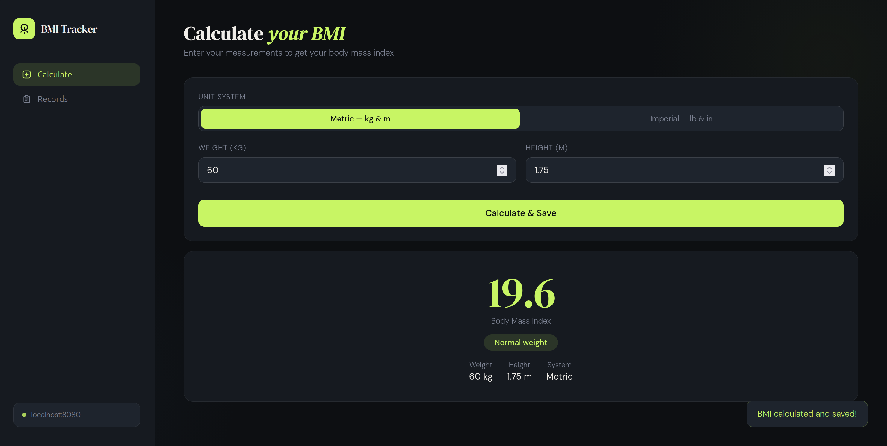
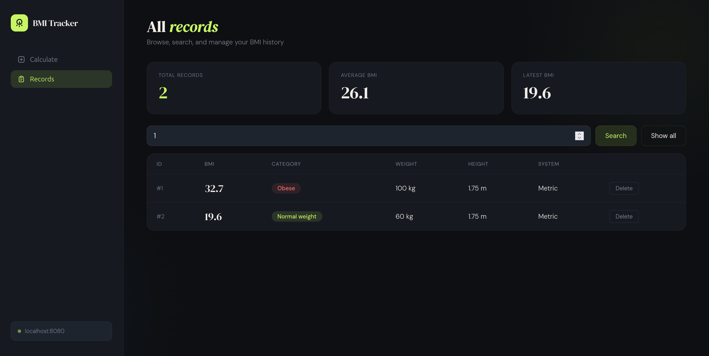

# 🧮 BMI Calculator — Spring Boot Backend

> **Training Project** — A RESTful backend API built with Spring Boot for calculating and tracking Body Mass Index (BMI) records.

---

## 📸 Screenshots

### UI Preview




---

## 📌 About the Project

This is a **Spring Boot training project** that demonstrates core backend development concepts including:

- Building RESTful APIs with `@RestController`
- Layered architecture (Controller → Service → Repository)
- JPA/Hibernate for database persistence
- DTO (Data Transfer Object) pattern
- CRUD operations via Spring Data

The app allows users to calculate their BMI (in both **metric** and **imperial** units), automatically categorizes the result, and saves every calculation to the database.

---

## 🗂️ Project Structure

```
src/
├── controllers/
│   └── BMIController.java       # REST endpoints
├── dto/
│   └── BMIRequest.java          # Request payload model
├── entity/
│   └── BMIRecord.java           # JPA entity (database table)
├── repository/
│   └── BMIRepository.java       # Spring Data CRUD repo
└── service/
    ├── BMIService.java          # Service interface
    └── BMIServiceImpl.java      # Business logic implementation
```

---

## 🔗 API Endpoints

| Method | Endpoint | Description |
|--------|----------|-------------|
| `POST` | `/BMI/calc` | Calculate BMI and save the record |
| `GET` | `/BMI/allBMI` | Get all saved BMI records |
| `DELETE` | `/BMI/delete/{id}` | Delete a BMI record by ID |

### Request Body — `POST /BMI/calc`

```json
{
  "weight": 70,
  "height": 1.75,
  "isMetric": true
}
```

- `weight` — body weight (kg for metric, lbs for imperial)
- `height` — height (meters for metric, inches for imperial)
- `isMetric` — `true` for metric system, `false` for imperial

### Response

Returns the calculated BMI as a `double`:

```json
22.86
```

---

## 📊 BMI Categories

| BMI Range | Category |
|-----------|----------|
| < 18.5 | Underweight |
| 18.5 – 24.9 | Normal weight |
| 25.0 – 29.9 | Overweight |
| ≥ 30.0 | Obese |

---

## ⚙️ How to Run

### Prerequisites

Make sure you have the following installed:

- **Java 17+**
- **Maven**
- A running **database** (H2 in-memory, MySQL, or PostgreSQL — depending on your `application.properties` config)

### Steps

**1. Clone the repository**
```bash
git clone https://github.com/your-username/bmi-calculator.git
cd bmi-calculator
```

**2. Build and run**
```bash
mvn spring-boot:run
```

The server will start at: `http://localhost:8080`

---

## 🧪 Testing the API

You can test the endpoints using **Postman**, **cURL**, or the included HTML frontend (`bmi-tracker.html`).

### cURL Example

```bash
curl -X POST http://localhost:8080/BMI/calc \
  -H "Content-Type: application/json" \
  -d '{"weight": 70, "height": 1.75, "isMetric": true}'
```

### Frontend

Open `bmi-tracker.html` directly in your browser while the backend is running. It connects to `http://localhost:8080` by default.

---

## 🛠️ Tech Stack

| Technology | Usage |
|------------|-------|
| Java 17+ | Core language |
| Spring Boot | Framework |
| Spring Data JPA | Database ORM |
| Hibernate | JPA implementation |
| Jakarta Validation | Input validation |
| Maven | Build tool |

---

## 📝 Notes

- This project was built for **learning purposes** as part of a Spring Boot training journey.
- CORS is enabled for all origins (`@CrossOrigin(origins = "*")`) to make frontend integration easy during development.
- Input validation is applied via Jakarta Bean Validation annotations (`@NotNull`, `@Positive`).

---

## 👨‍💻 Author

**Ahmed** — Spring Boot Trainee
